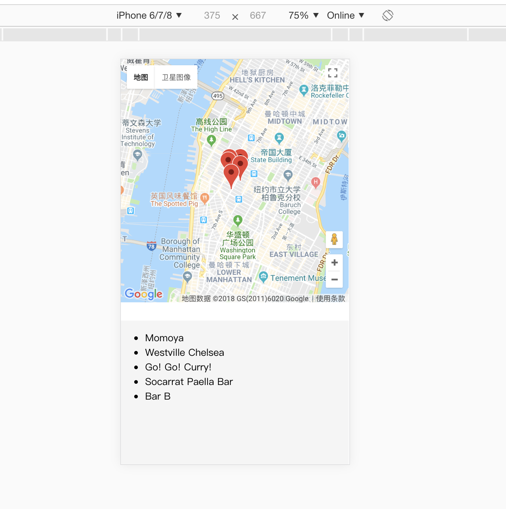

## How to run the project

To run the project in the **development mode**, follow the instructions below:

Download or clone the repository in your computer:
```
$ git clone https://github.com/dimikara/React-Neighborhood-Map-3.git
```
In the repository folder:
* install project dependencies with
```
npm install

```
* start the development server with
```
npm start
```

## Credits & Helpful Links
* how to use fetch api to get date [fetch api information](https://developer.foursquare.com/docs/api/venues/explore)

## Screenshot
